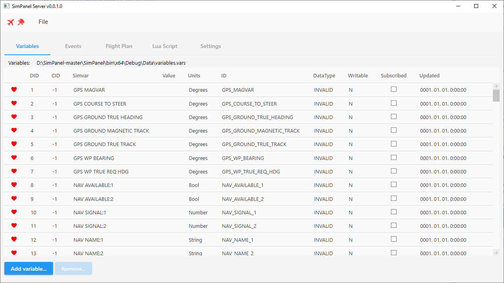
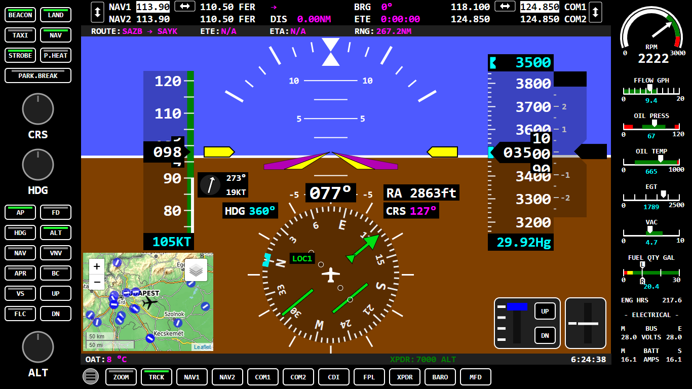
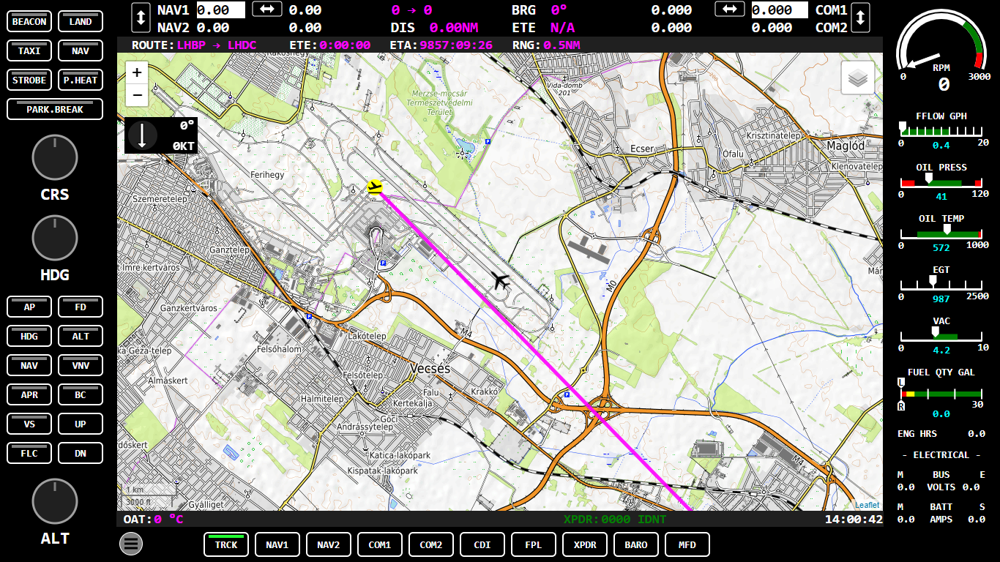
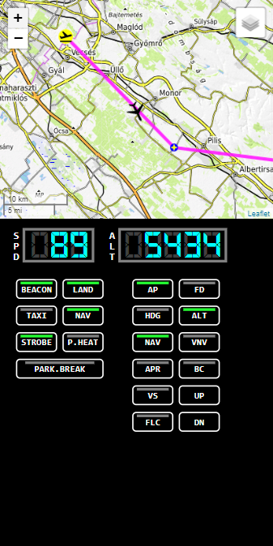
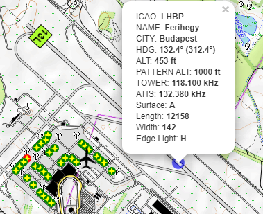

# FS2020 SimPanel (experimetal)

SimPanel is an application developed for the FS2020 C172 aircraft with touch screen and serial port support.

It has two main parts. One is the server, which handles variables and events through SimConnect and forwards the data to the clients. The other main part is the clients program, which provides display and management in a web browser. The server program is written in C#, while the client program is written in HTML, JS and uses SVG graphics.

The program is currently only tested with the C172, but can also be used on other aircraft.

To install, download the current release and unpack it somewhere. After startup, load variables and events from the Simpanel/Data folder. Then open the web browser with the "Open Index Page" button on the settings tab.

### SimPanel


### PFD


### MFD


### Mobile example


### Details:
The program is currently sized to a 15-inch monitor at 1366x768 pixels. It is not advisable to change this, scaling should be used instead.

```html
 
 body {
  / *  uncomment for 1920x1080 * /
  / * transform: scale (1.405563689604685212298682284041, 1.405563689604685212298682284041); * /
  transform: scale (1, 1);
  transform-origin: 0 0;
 }
```

### Database:
C:\Users\YourUserName\AppData\Roaming\ABarthel\little_navmap_db\little_navmap_msfs.sqlite
https://github.com/albar965/navdatareader

