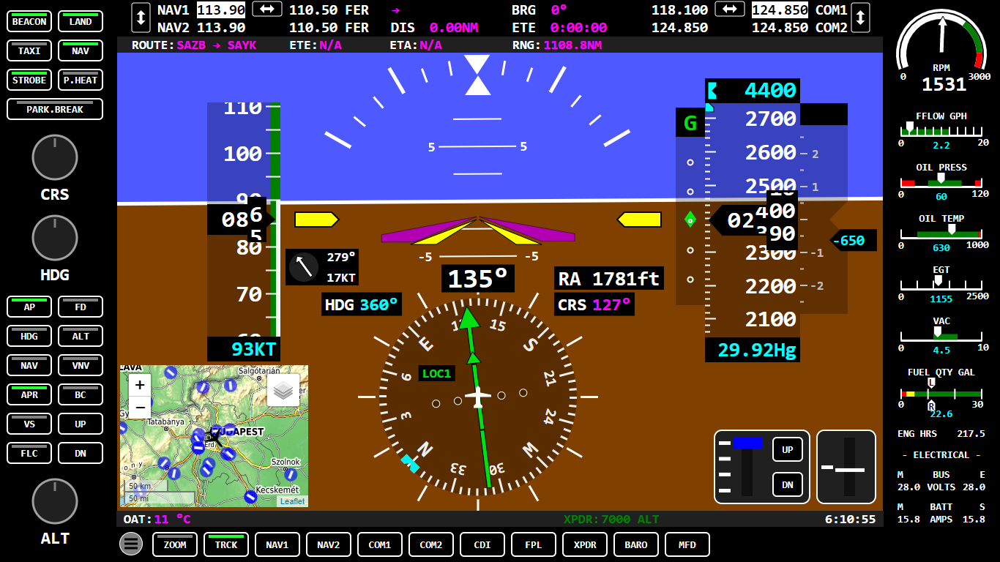

# FS2020 SimPanel (experimetal)

SimPanel is an application developed for the FS2020 C172 aircraft with touch screen and serial port support.

It has two main parts. One is the server, which handles variables and events through SimConnect and forwards the data to the clients. The other main part is the clients program, which provides display and management in a web browser. The server program is written in C#, while the client program is written in HTML, JS and uses SVG graphics.

The program is currently only tested with the C172, but can also be used on other aircraft.

To install, download the current [release](https://github.com/jungervin/SimPanel/releases) and unpack it somewhere. After startup, load variables and events from the Simpanel/Data folder. Then open the web browser with the "Open Index Page" button on the settings tab.

**(See how could you can create your own custom panel: [c172 Switches](https://github.com/jungervin/SimPanel/blob/master/SimPanel/HTML/c172switches.html))**

(Current svg widgets and their syntaxes are here : https://github.com/jungervin/SimPanel/blob/master/SimPanel/HTML/js/elements/svg_ext.js)

#### 2021-06-27 Updated Version 0.3 Changelog:
- Overlapped G1000 PFD & MFD
- https://youtu.be/Fkxn1plK5ZQ


#### 2021-05-21 Updated Version 0.2 Changelog:
- Database structure is changed
- Better Airport infos added to MFD v2

### Demo:
[](https://youtu.be/8cyhmR0oN2Q)


### SimPanel


### PFD


### MFD v0.2


### Mobile example


### Details:
PFD needs more power for high FPS than a Raspberry Pi can provide (I use an integrated motherboard with J4105 processor), but MFD can works on a stronger tablet.

[](Doc/images/cockpit01.png)

The program is currently sized to a 15-inch monitor at 1366x768 pixels. It is not advisable to change this, scaling should be used instead.

```html
 
 body {
  / *  uncomment for 1920x1080 * /
  / * transform: scale (1.405563689604685212298682284041, 1.405563689604685212298682284041); * /
  transform: scale (1, 1);
  transform-origin: 0 0;
 }
```

### Database:
If you use [Little Navmap](https://github.com/albar965/littlenavmap), then you can attach the database file into the simpanel or you can use [Navdatareader](https://github.com/albar965/navdatareader) to create database from the FS2020. 

[Little Navmap](https://github.com/albar965/littlenavmap) database file can be found somewhere here:
C:\Users\YourUserName\AppData\Roaming\ABarthel\little_navmap_db\little_navmap_msfs.sqlite

If database exists you will get more infomations about airports on the map:


### Serial Port and the Lua Script:
When data comes from the serial port, simpanel will call the Lua Script. Main method must be called Process(trigger), where trigger is the serial data.

Two methods are supported:

GetVariableValue(string varname) will give back the value of variable.

SendEvent(string eventname, uint value) will send an event with value to the Sim.

[Example of Script](https://github.com/jungervin/SimPanel/blob/master/SimPanel/Data/rotary.lua)

[Example of Rotary Encoder](https://github.com/jungervin/SimPanel/blob/master/Arduino/Switchpanel/RotaryEncoder/RotaryEncoder.ino)

